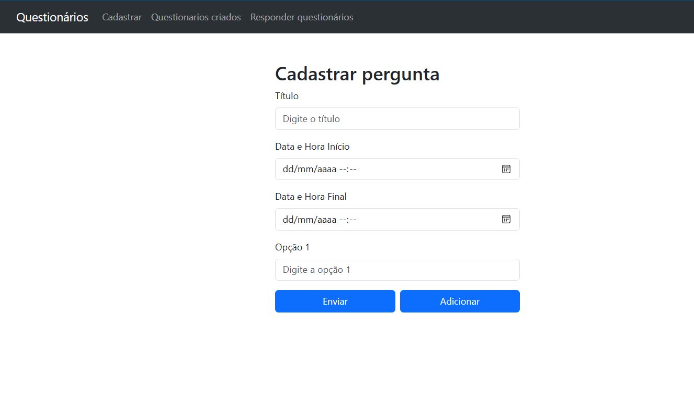
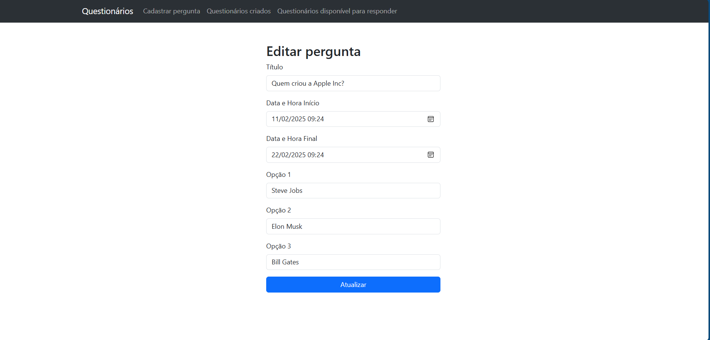
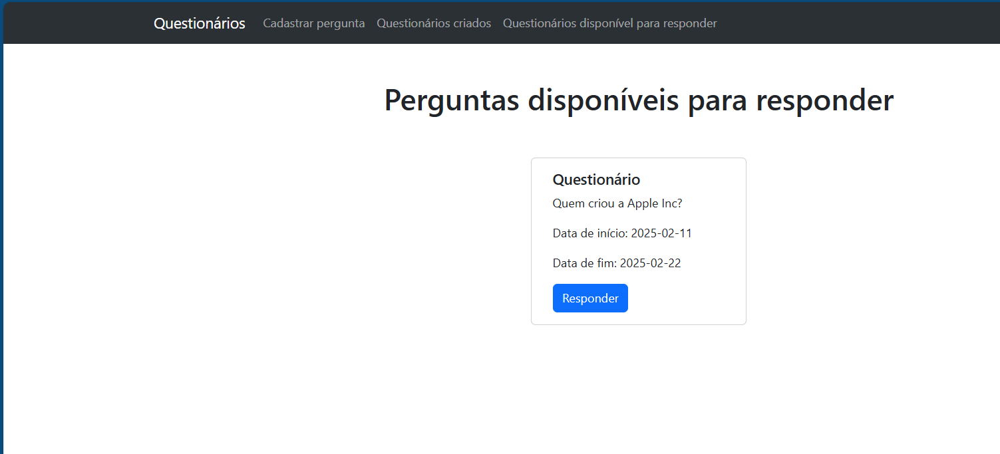
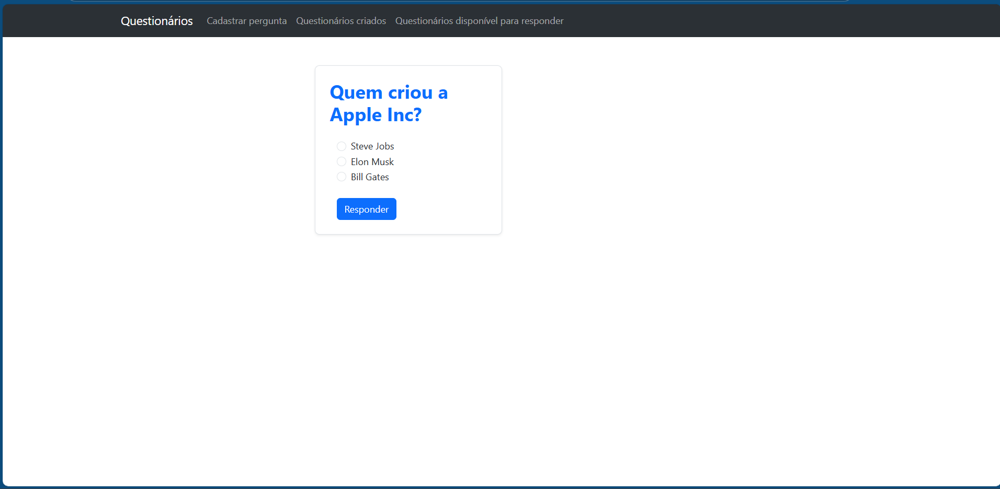

# 📋 Aplicação de Questionário

Uma aplicação web de questionário construída usando React e Vite, projetada para coletar e analisar respostas dos usuários de forma eficiente.

## 📚 Índice
- [🚀 Funcionalidades](#-funcionalidades)
- [🎯 Uso](#-uso)
- [⚙️ Instalação](#-instalação)
- [🛠️ Tecnologias](#-tecnologias)
- [🤝 Contribuindo](#-contribuindo)
- [📜 Licença](#-licença)

## 🚀 Funcionalidades
- Criar, editar e gerenciar questionários
- Interface amigável para envio de respostas
- Visualização de resultados em tempo real
- Armazenamento e processamento seguro de dados

## 🎯 Uso
### 📄 Página de Cadastro
Nesta página, o usuário pode cadastrar uma nova pergunta. Regras:
- Escolher uma data válida para início e término da questão.
- A data final precisa ser maior do que a inicial.
- Selecionar pelo menos 3 opções (menos que isso será inválido).
- Adicionar um título.



### 📋 Página de Perguntas Cadastradas
Nesta página, as perguntas cadastradas são listadas com opções para editar ou deletar.


### ✏️ Página de Edição de Pergunta
Aqui, o usuário pode editar qualquer campo da pergunta, seguindo as mesmas regras da página de cadastro.



### ✅ Página de Perguntas Disponíveis
As perguntas disponíveis para resposta são exibidas para os usuários.



### 📝 Página de Responder Pergunta
O usuário pode selecionar uma resposta para a pergunta. Apenas uma opção pode ser escolhida.



## ⚙️ Instalação
1. Clone o repositório:
   ```bash
   git clone /https://github.com/MIcaelFone/Frontend--questionario.git
   ```

2. Instale as dependências:
   ```bash
   npm install
   ```
3. Faça o build do projeto:
   ```bash
   npm run build
   ```
4. Inicie o servidor de desenvolvimento:
   ```bash
   npm run dev
   ```

## 🛠️ Tecnologias
- React + Vite
- JavaScript
- Tailwind CSS


## 🤝 Contribuindo
Contribuições são bem-vindas! Siga estas etapas:
1. Faça um fork do repositório
2. Crie um novo branch:
   ```bash
   git checkout -b feature/nova-funcionalidade
   ```
3. Commit suas alterações:
   ```bash
   git commit -m "Adicionar nova funcionalidade"
   ```
4. Envie para o seu branch:
   ```bash
   git push origin feature/nova-funcionalidade
   ```
5. Abra um Pull Request

## 📜 Licença
Este projeto está licenciado sob a Licença MIT.
